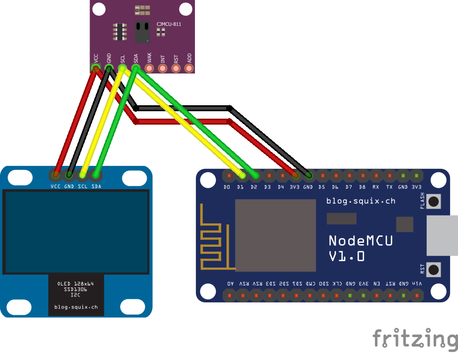
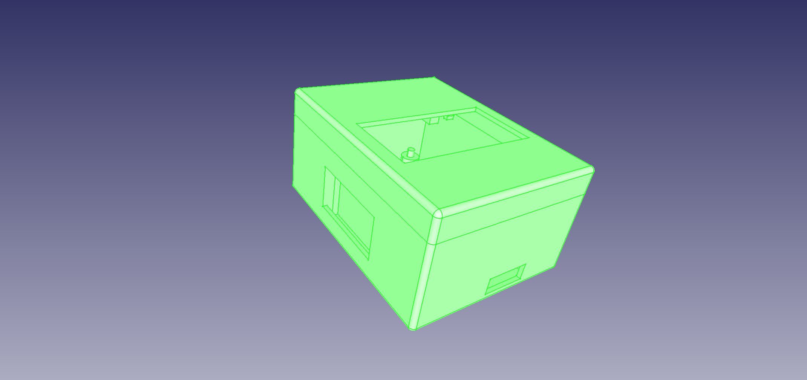
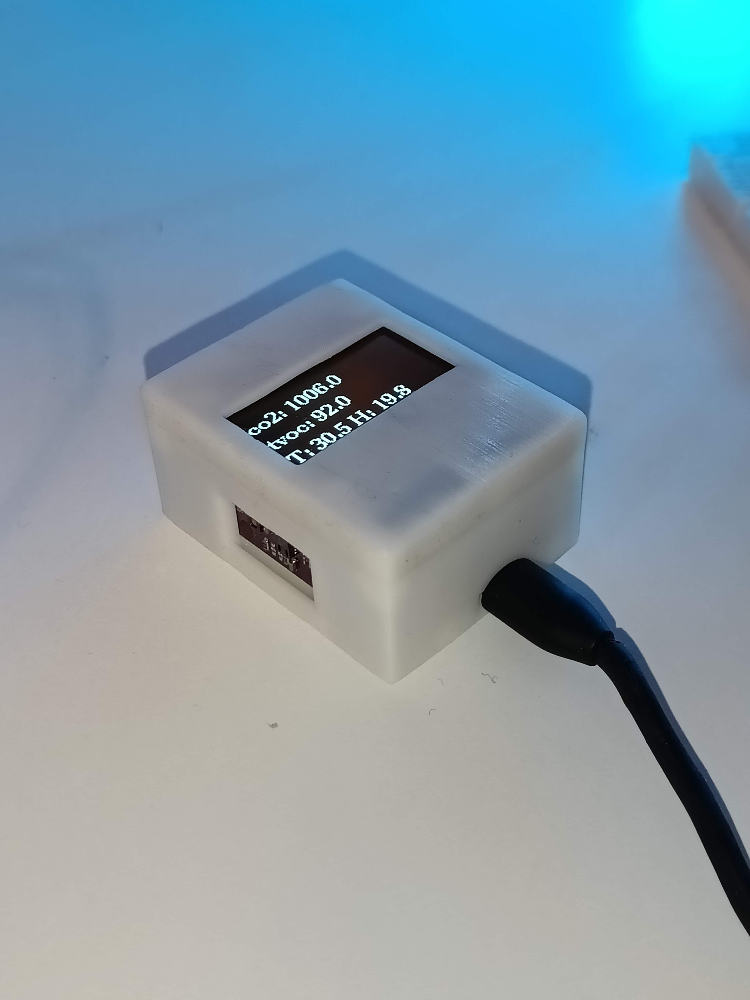

# env_sensor
esp32 sensors project

Environmental sensor using an esp 32.

Sensors supported:
 - CCS811 MOX sensor, eCO2, eTVOC
 - HTU21DF Temperature and humidity sensor
 
Uses WiFiManager library for wifi configuration, soft ap to enable simple connection to different wifi.

Sends data over MQTT.

